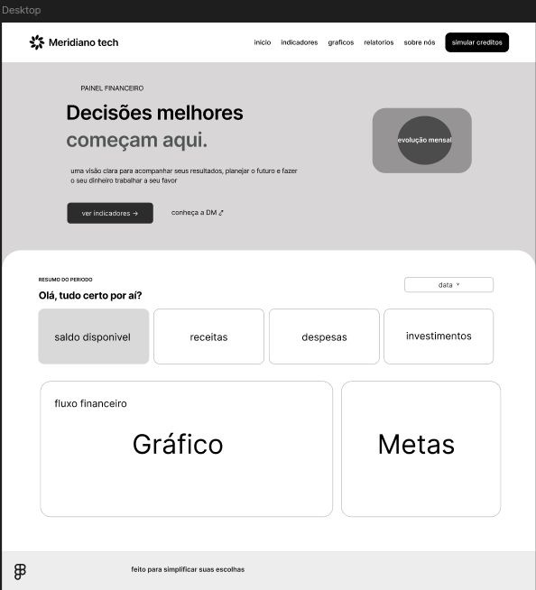

# Documentação de Wireframe 
## Plataforma Meridiano Tech
O wireframe da tela principal apresenta uma interface de painel financeiro projetada para a análise de dados do Projeto Concessão de Crédito.
O layout está estruturado de forma objetiva nas seguintes seções visuais:
Cabeçalho: Contém o logotipo "Meridiano tech", menu de navegação horizontal e o botão de ação principal "simular creditos". 
    
Área de Contextualização: Apresenta a chamada principal "Decisões melhores começam aqui", acompanhada de um texto explicativo, links rápidos e um bloco reservado para visualizar a "evolução mensal". 
      
Resumo do Período (Dashboard): É a área central de consumo de dados, composta por um filtro temporal (data) e quatro cartões indicadores de acesso rápido: saldo disponível, receitas, despesas e investimentos. Abaixo deles, encontram-se dois grandes blocos destinados à exibição do "gráfico" de fluxo financeiro e ao acompanhamento de "metas".   
        
Rodapé: Barra de encerramento minimalista com o símbolo da marca e o slogan do projeto.   

